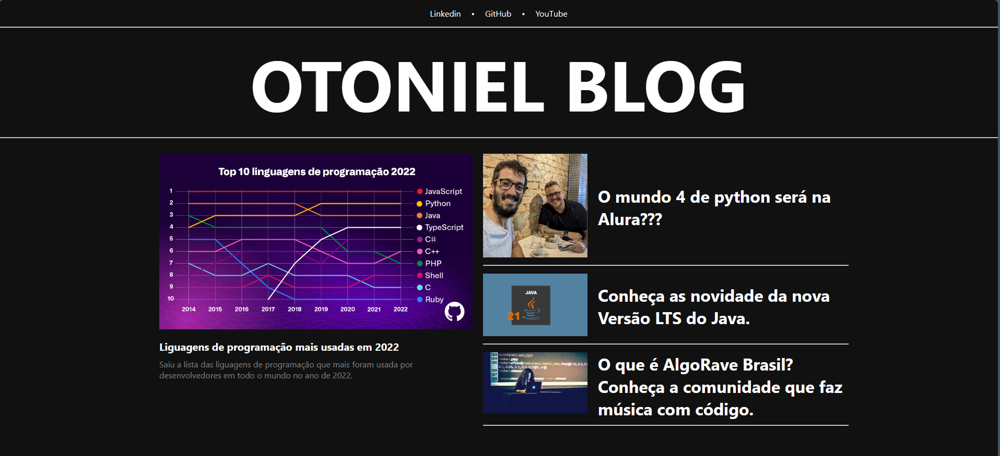

# AngularBlog

Um blog de noticias desenvolvido com angular para consolidar os conhecimentos no framework durante o Bootcamp na DIO. ([Link para o repositorio onde estou documetando as aulas do bootcamp](https://github.com/otonielnn/Dio-Angular))

  

